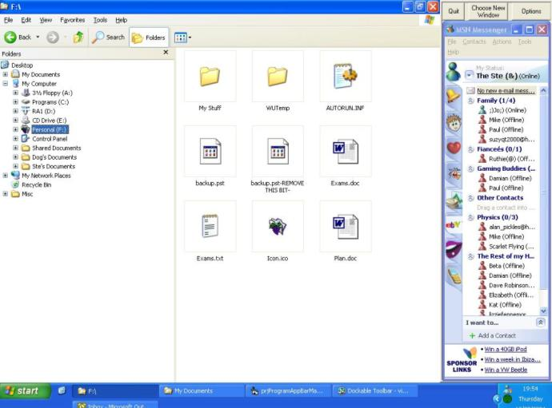



## Turn any program into an App Bar \(Desktop Toolbar\)

### Description

This code lets you turn almost any program into an AppBar (that is, make it a dockable toolbar on your desktop). You could for instance, have MSN Messenger docked at the side of your screen so it's always visible and other windows don't maximize over it. The AppBar and TaskBar DLL code was mostly not written by myself; I merely combined the two into this project because they did what I needed them to do.

You should run the GROUP PROJECT and NOT the individual projects.

Thanks to Patrick Bigley for the AppBar code and Jim White for the Taskbar code.
 
### More Info
 
This has been tested on XP Home (SP1) only. It should work on Windows 9x and above but I haven't tried it.

             |
---                |---
**Submitted On**   |2004-08-07 23:39:38
**By**             |[Stephen Robson](https://github.com/Planet-Source-Code/PSCIndex/blob/master/ByAuthor/stephen-robson.md)
**Level**          |Advanced
**User Rating**    |5.0 (35 globes from 7 users)
**Compatibility**  |VB 6\.0
**Category**       |[Miscellaneous](https://github.com/Planet-Source-Code/PSCIndex/blob/master/ByCategory/miscellaneous__1-1.md)
**World**          |[Visual Basic](https://github.com/Planet-Source-Code/PSCIndex/blob/master/ByWorld/visual-basic.md)
**Archive File**   |[Turn\_any\_p1781238122004\.zip](https://github.com/Planet-Source-Code/stephen-robson-turn-any-program-into-an-app-bar-desktop-toolbar__1-55532/archive/master.zip)

